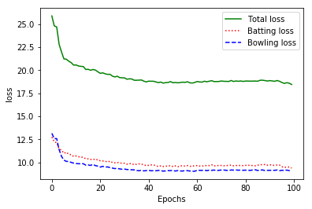

# Alpha Zero General (any game, any framework!)

A simplified, highly flexible, commented and (hopefully) easy to understand implementation of self-play based reinforcement learning based on the AlphaGo Zero paper (Silver et al). It is designed to be easy to adopt for any two-player turn-based adversarial game and any deep learning framework of your choice. A sample implementation has been provided for the game of Othello in PyTorch, Keras, TensorFlow and Chainer. An accompanying tutorial can be found [here](http://web.stanford.edu/~surag/posts/alphazero.html).

```Coach.py``` contains the core training loop and ```MCTS.py``` performs the Monte Carlo Tree Search. The parameters for the self-play can be specified in ```main.py```.

To start training a model for connect4:
```bash
python main.py
```
Choose your framework and game in ```main.py```.

# Overview
connect4 folder is game related program file
	
	CricketGame.py :
		it defines small function about the games like getting board states and action states , ending game function
	

------------------------------------------------------------------
	MCTS.py :
	This file uses monte carlo tree search for generating good policy during the self play.

	Coach.py :
	this contain the learning method of neural network 

neural network is defined inside connect4/tensorflow folder.

	Arena.py :
	This contains method which will do the tournament between the agents.
# Results	
KL-UCB Regret in multi-arm bandit is less than the UCB regret. This information can be utilised and be implemented in action selection from a state as similar to kl-ucb selection of multi-arm bandit. The below loss function suggest the same that self-play using MCTS with KL-UCB vs MCTS with UCB.

Tournament between these shows 53 Wins ,39 Loss and 8 Draws by the kl-ucb.


